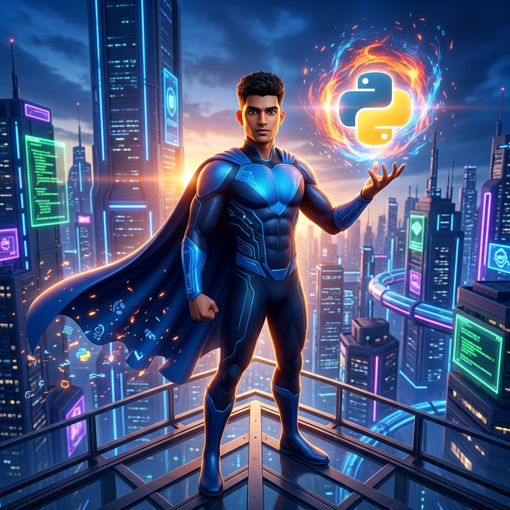

<div align="center">

<!-- HERO SECTION -->


<br/>

# ⚡ ABHISHEK KUMAR

### `Full Stack Engineer` · `AI Builder` · `Open Source Enthusiast`


<br/>

<!-- SOCIAL ICONS -->
<a href="https://buildbyabhi.github.io"></a>
&nbsp;
<a href="https://www.linkedin.com/in/buildwithabhi"></a>
&nbsp;
<a href="https://www.instagram.com/buildbyabhi"></a>
&nbsp;
<a href="mailto:buildbyabhi.dev@gmail.com"></a>
&nbsp;
<a href="https://github.com/buildbyabhi"></a>

<br/>


&nbsp;&nbsp;
<a href="https://github.com/buildbyabhi?tab=followers"></a>

</div>

<br/>

<!-- ═══════════════════════════════════════════════════════════════ -->

## 🧑‍💻 About Me

```js
const abhishek = {
    pronouns: "he" | "him",
    currentRole: "Full Stack Engineer & AI Builder",
    location: "India 🇮🇳",
    workingOn: "AI-powered products & modern web experiences",
    learning: ["LLMs", "Prompt Engineering", "System Design", "Vector DBs"],
    askMeAbout: ["React", "Node.js", "Python", "AI/ML", "System Design"],
    funFact: "I debug in my dreams 🌙"
};
```

<br/>

## 🚧 Currently Building

| Project | Description | Stack |
|---------|-------------|-------|
| [**Reel2YT**](https://github.com/buildbyabhi/Reel2YT) | Paste an Instagram Reel URL → extract the song → listen & add to YouTube playlist | React Native · Gemini AI · YouTube API |
| [**ExpensePro**](https://github.com/buildbyabhi/expensepro-fullstack) | Premium full-stack finance tracker with interactive charts | React · Node.js · MongoDB · JWT |
| [**GeminiChat**](https://github.com/buildbyabhi/gemini-chat) | ChatGPT-style AI assistant with streaming markdown | React · Gemini API · Node.js |

<br/>

<!-- ═══════════════════════════════════════════════════════════════ -->

<div align="center">

## 🛠️ Tech Arsenal

**`Backend`**<br/>
<a href="https://skillicons.dev"></a>

<br/><br/>

**`Frontend`**<br/>
<a href="https://skillicons.dev"></a>

<br/><br/>

**`Cloud & DevOps`**<br/>
<a href="https://skillicons.dev"></a>

<br/><br/>

**`Databases`**<br/>
<a href="https://skillicons.dev"></a>

<br/><br/>

**`AI / ML`**<br/>
<a href="https://skillicons.dev"></a>
&nbsp;


<br/><br/>

**`Tools`**<br/>
<a href="https://skillicons.dev"></a>

</div>

<br/>

<!-- ═══════════════════════════════════════════════════════════════ -->

<div align="center">

## 🚀 Featured Projects

<a href="https://github.com/buildbyabhi/Reel2YT"></a>
<a href="https://github.com/buildbyabhi/expensepro-fullstack"></a>

<a href="https://github.com/buildbyabhi/gemini-chat"></a>
<a href="https://github.com/buildbyabhi/buildbyabhi.github.io"></a>

<br/>

<a href="https://github.com/buildbyabhi?tab=repositories"></a>

</div>

<br/>

<!-- ═══════════════════════════════════════════════════════════════ -->

<div align="center">

## 📊 GitHub Analytics


<br/>


<br/><br/>


<br/>


<br/>

<picture>
  <source media="(prefers-color-scheme: dark)" srcset="https://raw.githubusercontent.com/buildbyabhi/buildbyabhi/output/github-snake-dark.svg" />
  <source media="(prefers-color-scheme: light)" srcset="https://raw.githubusercontent.com/buildbyabhi/buildbyabhi/output/github-snake.svg" />
  
</picture>

</div>

<br/>

<!-- ═══════════════════════════════════════════════════════════════ -->

<div align="center">

## 🤝 Let's Connect


<br/><br/>

*Building something cool? I'd love to hear about it.*<br/>
*Let's create something people actually use.*

<br/>

<a href="mailto:buildbyabhi.dev@gmail.com"></a>
&nbsp;
<a href="https://www.linkedin.com/in/buildwithabhi"></a>

</div>

<br/>

<div align="center">

</div>
